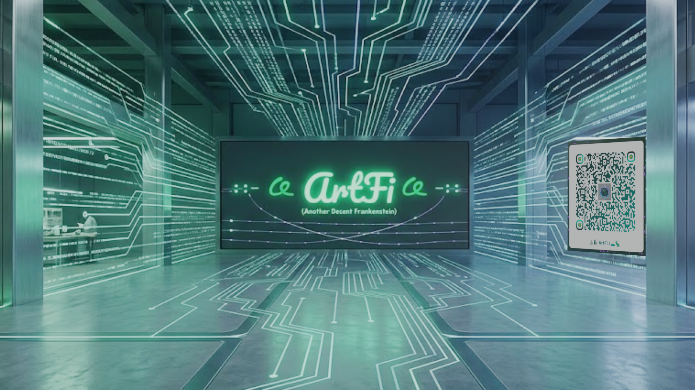

# ArtFi



[ArtFi ENS profile](https://app.ens.domains/artfi.thejollylama.eth)


ArtFi is a simple soft-launch micro-liquidity layer for Artizen newcomers.

The core idea is straightforward: if someone is waiting for their first Artizen payout, they can post a request for ART (or another approved asset) with clear repayment terms. Another wallet can offer to fund it under those terms. Until that happens, or instead of it, people can also earn ART directly by contributing repo work or by running an IPFS node.

There are no boost points or off-chain credits in ArtFi. Everything is either a request/offer you fund on-chain, or ART you earn directly from a settlement fund.

## The short version

There are two practical ways to earn ART today:

1. Post a request and get it filled
   - A newcomer posts a request specifying the asset, principal amount, repayment amount, and deadlines.
   - Another wallet reviews those terms and funds the request as an offer.
   - The request and offer are escrowed, settled, and recorded on-chain.
   - This is the centerpiece of ArtFi: a newcomer does not have to wait in limbo for their first Artizen payout.

2. Earn ART directly from the network
   - Do repo work and claim a `bounty:` or `test-bounty:` labeled issue; payment comes from the `artfi-repo-dev` fund allocation.
   - Run and register an IPFS/Kubo node; payment comes from the `node-reward-fund` allocation once you pass checker spot-checks.

## Ways to earn tokens

### A. Request + offer flow

This is the main on-ramp for new Artizen participants.

- A creator posts a request: asset, principal, repayment amount, funding deadline, and repayment due date.
- A sponsor reviews those terms and funds the request, which mints their offer NFT.
- Funds are held in escrow until repayment or settlement.
- Repayment or settlement is recorded on-chain against the original request and offer.

This is the path for “I need a little runway on clear terms while I wait for my first real Artizen payout.”

### B. Repo and issue work

The payroll bot recognizes labels like:

- `bounty: 25 ART`
- `bounty: 100 ART`
- `test-bounty: 10 ART`
- `idea-credit: @username`

If a PR is merged into `main` and linked to the issue, the payout is queued from the `artfi-repo-dev` settlement fund for administrator review.

### C. IPFS node rewards

If you run a Kubo/IPFS node and register it through the ArtFi network registry:

- you must register the node and get admin approval
- the node must pass 25 independent checker spot-checks in a month
- once eligible, a configured ART reward is paid from the `node-reward-fund` allocation

This is the “keep the decent-artizen data alive” path for people who want to help power the network without needing an immediate funding request.

## Getting started today

You do not need to deploy anything. ArtFi's contracts are already live; you just clone the repo, run it locally, and connect your wallet to the main deployed contracts.

The app can also be mirrored on IPFS. The pinned interface loads current payroll and Canopy data from GitHub Pages; email verification and shared Pinata uploads use the hosted Render auth service. Local IPFS Desktop uploads go directly to your own node. A gateway origin must be allowed by the auth service before email and shared Pinata features work from that mirror.

### 1) Clone and install

```bash
git clone https://github.com/TheJollyLaMa/ArtFi.git
cd ArtFi
npm install
cp .env.example .env
```

### 2) Point your local setup at the live contracts

Fill in `.env` with the already-deployed addresses (do not generate new ones):

- `ARTFI_PROTOCOL_ADDRESS`
- `ARTFI_NETWORK_REGISTRY_ADDRESS`
- `ARTFI_SETTLEMENT_ROUTER_ADDRESS`
- `ART_TOKEN_ADDRESS`

These are the same contracts everyone else in ArtFi is using. Your local setup calls and posts to them; it does not create separate copies of them.

### 3) Run the app locally

```bash
npx http-server . -p 8002
```

Open `index.html` in the browser, connect your wallet, and you can create requests, fund offers, or manage your node reward settings against the live contracts.

### 4) Register and run a node (optional, but recommended)

Generate the required node hashes and register the node against the live registry:

```bash
npm run network:node-hashes
npm run network:register-node
```

An admin must approve your node before spot-checks count. Once approved, help build the read-only network index:

```bash
npm run index:network
```

### 5) Run the tests (optional, for contributors)

```bash
npm test
```

Deploying your own copy of `ArtFiProtocol`, `ArtFiNetworkRegistry`, and `ArtFiSettlementRouter` with `scripts/deploy.js` is only for someone forking the entire system into their own independent network. That is not what we're suggesting here — everyone in this soft launch shares the same main contracts.

## Soft launch note

ArtFi is ready for a soft launch with our first small group of participants.

It is intentionally simple:

- people can request ART on clear terms while waiting for a first Artizen payout
- people can earn ART directly through repo work or by running node infrastructure
- the protocol keeps requests, offers, and payouts transparent and auditable on-chain

The point is not perfection; it is to get the first 12 people moving, earning, and connected without friction.

If you are one of the first 12, start with one of these:

- post a request with your terms (asset, amount, repayment, deadline)
- review an open request and fund it as an offer
- claim a `bounty:` or `test-bounty:` labeled issue
- register an IPFS node and help keep the data layer alive

That is enough to get going today.

